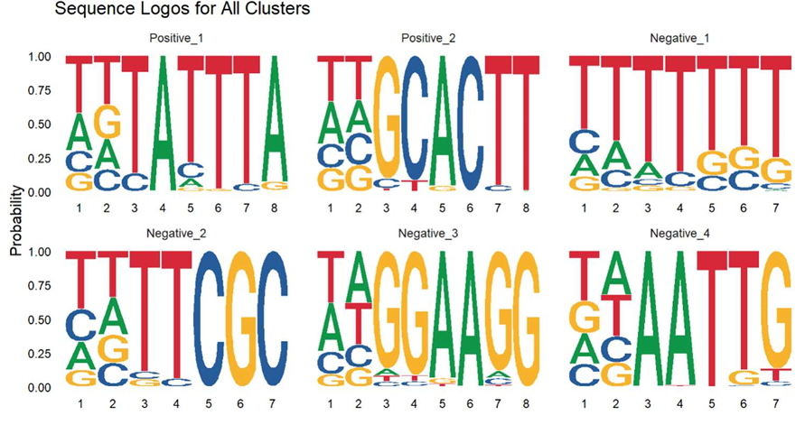

## What problem does this project solve?

At the most basic level, this project studies the relationship between **text-like data**
and **numbers**.

Each gene is represented by:
- A **genetic sequence** – a very long string made of only four letters:  
  **A, C, G, T**, which represent the chemical building blocks of DNA  
- A **single continuous value** measured for that gene  
  (for example: expression level, stability, or activity)

A typical dataset looks like this conceptually:


| Gene   | DNA sequence (very long) | Measured value |
|--------|--------------------------|----------------|
| Gene 1 |        ATTTCCCG...       |       3.34     |
| Gene 2 |        TTTACACG...       |       5.76     |
| Gene 3 |        CGCGCGCG...       |       3.56     |


The core question is:

**Which small parts of the sequence are influencing the measured value?**

---

## Why is this a difficult problem?

In real biological data, each gene contains **hundreds to thousands of letters**.
However, the measured value is often influenced by **only a small region inside the
sequence**, and we do not know in advance:
- Where that region is located
- How long it is
- Or what exact pattern it follows

This creates a fundamental mismatch:
- The data is **long, noisy, and high-dimensional**
- The signal is **local, subtle, and sparse**

From a statistical perspective, this means searching for weak signals hidden inside
large amounts of irrelevant background.

---

## Why not simplify the problem?

A common workaround is to simplify the data:
- Convert the continuous values into categories (e.g. “high” vs. “low”)
- Compare sequences between groups

This makes analysis easier, but introduces serious problems:
- The threshold is arbitrary
- Important information is lost
- Small but consistent effects disappear
- Results become unstable across datasets

This project deliberately avoids such simplifications.

Instead, it explores how to **link sequence patterns directly to continuous values**.

---

## Where did this project start?

The project builds on an existing k-mer–based analysis approach developed in a
computational genetics laboratory.

The basic idea is:
1. Break each long sequence into short overlapping substrings (“k-mers”)
2. For each k-mer, compare the continuous values of genes that contain it
   to those that do not
3. Use statistical testing to detect associations

While intuitive, this approach raises important questions:
- How much statistical power do we actually have?
- How do multiple-testing effects distort results?
- Which effects are statistically significant but biologically meaningless?
- How do we move from thousands of short k-mers to interpretable sequence motifs?

This project focuses on **understanding these limitations**, not just running the pipeline.

---

## Why use simulation?

With real biological data, the true answer is unknown.

You never know:
- Which sequence patterns truly matter
- How strong their effects are
- Or whether the algorithm is failing silently

To address this, the project uses a **controlled simulation framework**.

The simulation generates synthetic gene sequences and assigns a continuous value
to each gene, while allowing full control over:
- Which sequence motifs exist
- How often they appear
- How strongly they influence the measured value
- Background sequence composition and noise

This makes it possible to systematically study:
- When the method works
- When it breaks down
- And why

All data analyzed in this repository was generated using this simulation.

---



## 📄 Full report (recommended reading)

- A complete methodological report with figures, statistical analysis, and discussion  
  is available as a **PDF in the `paper/` directory**.
- The report contains **all visualizations and quantitative results** referenced here.

➡️ **Location:** `paper/`  
➡️ **File:** Final report PDF

Readers who want a deeper technical explanation are encouraged to start there.

---

## What this repository provides

### Analysis scripts (`src/`)

- **`from_kmers_to_motifs.R`**  
  Converts statistically significant k-mers into interpretable sequence motifs using
  genomic window merging, clustering, and multiple sequence alignment.

- **`simulate_genome.R`**  
  Generates synthetic gene sequences and continuous traits for controlled evaluation.

- **`power_analysis.R`**  
  Independent power analysis comparing statistical tests under different effect sizes
  and multiple-testing regimes.

---

## Environment setup (renv)

This project uses renv to ensure reproducible package versions.
To recreate the analysis environment:

```r
install.packages("renv")
renv::restore()
```

This command installs the exact R package versions specified in renv.lock, allowing
the code to be run without manual dependency management.

---

## Context

This work was developed as part of research conducted in a computational genetics
laboratory (Dr. Michal Rabani, Department of Genetics).  